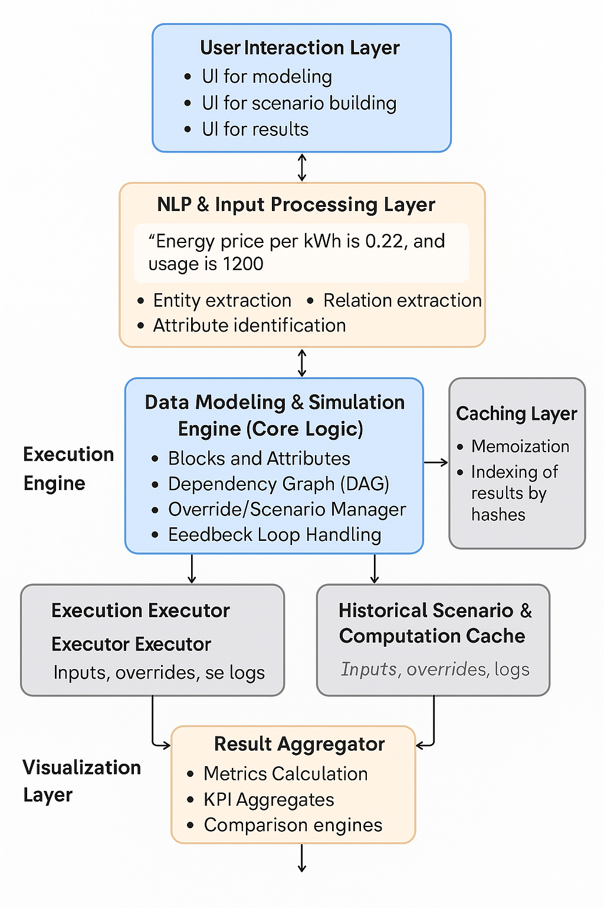

# 🧠 End-to-End System Flow: Input to Simulation & Insight

This flow describes how data moves through the Circonomit system architecture—from the user's input to simulated insights and final visualization.

---

## 🔄 Data Flow Breakdown

### 1. **User Input**
- The user provides business context in natural language (e.g., chat, document).
- Example: “Energy cost per kWh is expected to increase by 20% next quarter.”

---

### 2. **Natural Language Parser (Task 3)**
- This layer extracts structured concepts from unstructured text using NLP.
- Identifies:
  - Entities (e.g., `energy_price_per_kwh`)
  - Relationships (e.g., dependency between energy usage and cost)
  - Definitions (input vs. calculated attributes)

---

### 3. **Structured Model (Blocks & Attributes)**
- Attributes are grouped into **Blocks** (like `Energy`, `Production`, etc.).
- Each attribute is either:
  - `Input`: provided directly or from scenarios
  - `Calculated`: derived via formulas and dependencies

---

### 4. **Scenario Overrides (Task 1)**
- Enables simulation of alternative realities (e.g., high CO₂ costs).
- Temporarily overrides default input values in a controlled, named **Scenario**.
- Stored separately for traceability and reproducibility.

---

### 5. **Calculation Engine (Task 2)**
- Builds a **Dependency Graph** of calculated attributes (DAG).
- Executes calculations in topological order (no cycles).
- Caches results to avoid recomputation and enables partial recalculation.

---

### 6. **Execution Order (DAG)**
- Validates dependency integrity.
- Detects cycles, supports fixed-point iterations (for feedback loops).

---

### 7. **Simulation Results**
- Outputs new values for all affected attributes.
- Enables comparison across scenarios or against baseline data.

---

### 8. **Visualization Layer (Task 4)**
- Results are visualized in an interactive dashboard:
  - Editable inputs
  - Scenario comparisons
  - Dependency graph & sensitivity analysis
- Designed for **non-technical users** to gain insight and take action.

---

## 💡 Summary

| Step | Task | Purpose |
|------|------|---------|
| 1 | - | User input provided in natural language |
| 2 | Task 3 | Parse input into structured concepts |
| 3 | Task 1 | Store structured model & attributes |
| 4 | Task 1 | Apply scenario overrides |
| 5 | Task 2 | Run simulation using dependency engine |
| 6 | Task 2 | Optimize computation order via DAG |
| 7 | - | Collect simulation results |
| 8 | Task 4 | Present results with clarity and impact |

---
```

```
